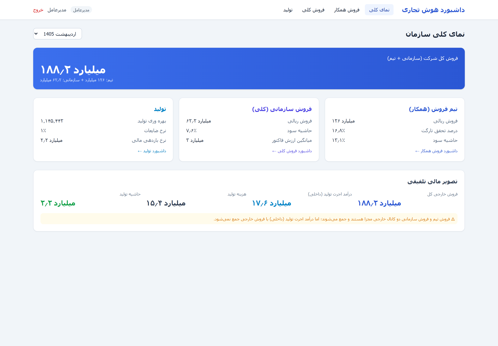
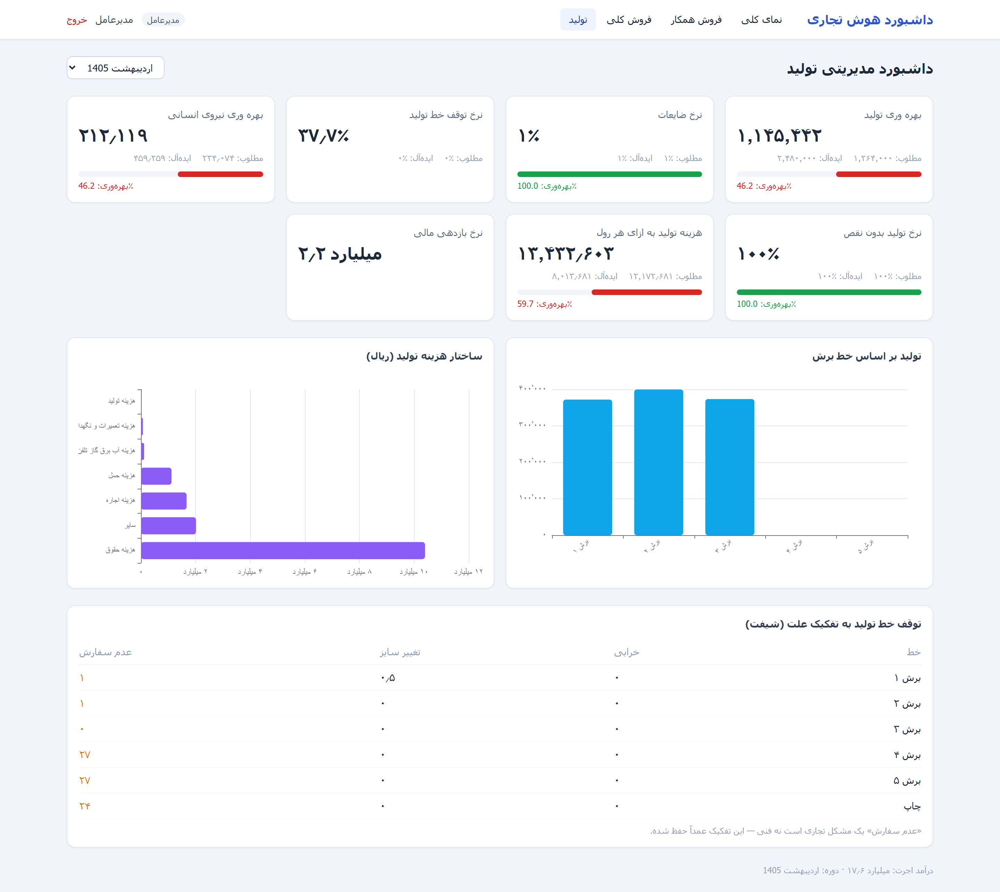
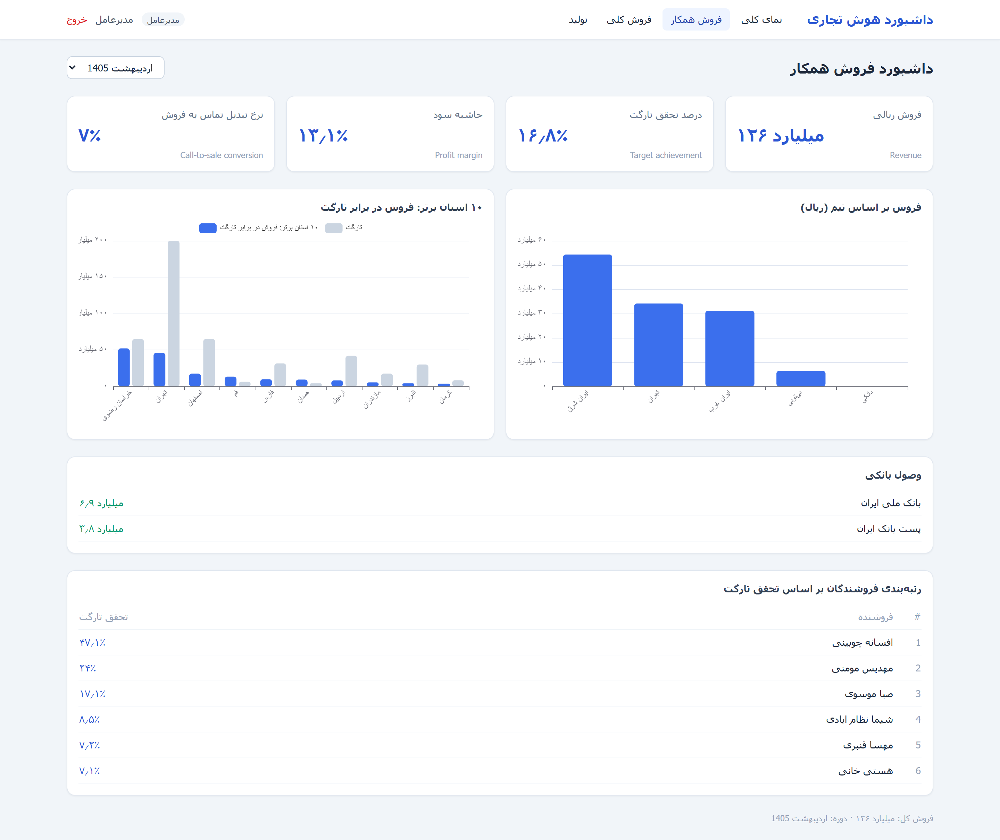
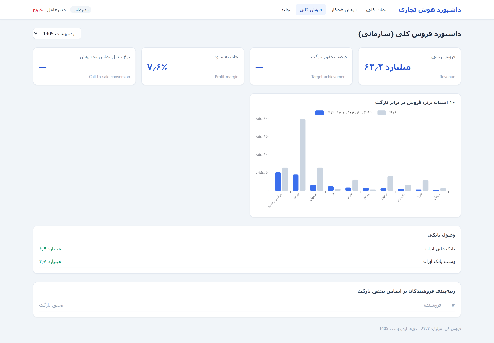
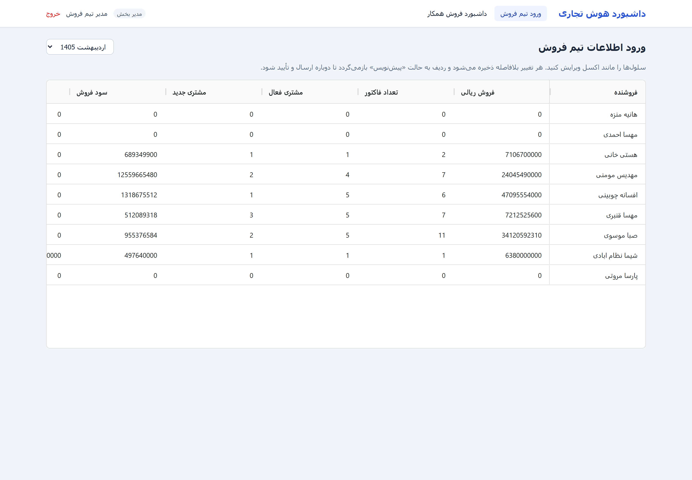
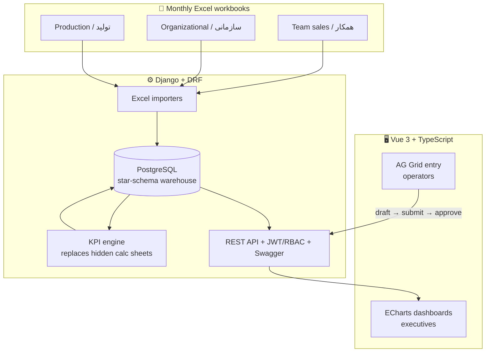

<div align="center">

# 📊 Enterprise BI Platform · پلتفرم هوش تجاری سازمانی

**A centralized executive-reporting, KPI-management and analytics platform** — replacing a
manual, Excel-based monthly reporting workflow with a proper data warehouse, an Excel-like
data-entry experience for operators, and live dashboards for executives.

جایگزینی گزارش‌گیری دستی مبتنی بر اکسل با یک پلتفرم متمرکز هوش تجاری: انبار داده، ورود اطلاعات شبیه اکسل برای اپراتورها، و داشبورد زنده برای مدیران.


</div>



---

## What it is · معرفی

Built for a **paper-roll manufacturer + nationwide distributor** by reverse-engineering
three real monthly KPI workbooks (sales team, organizational sales, production). Operators
enter data in an Excel-like grid → managers approve → executives see live Power-BI-style
dashboards. **Approved data is the single source of truth.**

این پلتفرم برای یک شرکت **تولید رول کاغذ + توزیع سراسری** ساخته شده و از دل سه فایل واقعی KPI ماهانه (تیم فروش، فروش سازمانی، تولید) مهندسی معکوس شده است. اپراتور داده را در گرید شبیه‌اکسل وارد می‌کند ← مدیر تأیید می‌کند ← مدیرعامل داشبورد زنده می‌بیند. **داده تأییدشده، منبع واحد حقیقت است.**

Two user personas:
- **CEO (executive)** — read-only, sees all four dashboards (Overview · Production · Team Sales · Organizational Sales).
- **Department managers** — each edits **only** their own section/channel.

---

## Screenshots · تصاویر

| Production dashboard (7 KPIs) | Team-sales dashboard |
|---|---|
|  |  |

| Organizational sales | Excel-like entry grid (AG Grid) |
|---|---|
|  |  |

---

## Architecture · معماری



**Dimensional model (star schema).** Conformed dimensions — `DimPeriod` (Jalali month),
`DimEmployee`, `DimTeam`, `DimProvince`, `DimBank`, `DimMachine`, `DimProduct`, `DimKPI` —
shared across domains. Facts: `FactSalesMonthly` (employee × channel × month),
`FactProduction` (machine × month), cost/revenue/collection facts, and a single conformed
`FactKPI` (computed results at company / team / employee / machine scope) that **both** sales
and production write to. The workbooks' hidden calculation sheets become code in
`services/kpi.py`, not formulas in a grid.

---

## Key results (اردیبهشت ۱۴۰۵, on real data)

| Metric | Value |
|---|---|
| **Total company sales** (team + organizational) | **۱۸۸٫۲ B Rial** |
| — Team channel (9 reps) | 126.0 B |
| — Organizational channel (2 key accounts) | 62.2 B |
| Production output vs 16 000/shift benchmark | 1,145,442 |
| Production waste rate (from material balance) | ~1% |
| Production margin (piece-rate − cost) | 2.19 B |
| Backend tests | **11 passing** |

> **Engineering note.** The source workbooks contained real defects — `#REF!` references, an
> unclosed-parenthesis waste formula, `#DIV/0!` cells, and a team-profit average that should
> have been a sum. These are **fixed and documented in code**, not copied. Ratios are computed
> from aggregated numerators (not averaged per-row ratios). Internal piece-rate income is kept
> strictly separate from external invoiced sales.

---

## Tech stack

**Backend** Python 3.13 · Django 5 · DRF · PostgreSQL · Redis · Celery · RabbitMQ · openpyxl · JWT + RBAC · drf-spectacular (Swagger)
**Frontend** Vue 3 · TypeScript · Vite · Pinia · Vue Router · TailwindCSS · Apache ECharts · AG Grid (Community) · Axios
**Infra** Docker Compose · Nginx · GitHub Actions

---

## Quick start · اجرا

### Local (SQLite — zero config)

```bash
# Backend
cd backend
python -m venv .venv
.venv/Scripts/python -m pip install -r requirements.txt
.venv/Scripts/python manage.py migrate
.venv/Scripts/python manage.py seed_sales
.venv/Scripts/python manage.py seed_production
.venv/Scripts/python manage.py seed_users          # CEO + 3 managers + admin
.venv/Scripts/python manage.py import_sales_excel        --employee-file "…/KPI همکار اردیبهشت 1405.xlsx"   --year 1405 --month 2 --approve
.venv/Scripts/python manage.py import_org_sales_excel    --file          "…/سازمانیKPI ورودی اردیبهشت 1405.xlsx" --year 1405 --month 2 --approve
.venv/Scripts/python manage.py import_production_excel    --file          "…/KPI اردیبهشت تولید1405.xlsx"     --year 1405 --month 2 --approve
.venv/Scripts/python manage.py runserver           # :8000 · Swagger at /api/docs/

# Frontend (new terminal)
cd frontend && npm install && npm run dev          # :5173
```

### Docker (full stack)

```bash
cp .env.example .env      # then set SECRET_KEY etc.
docker compose up --build # app+API via Nginx :8080 · RabbitMQ UI :15672
```

### Users (password `demo12345`)

Only these accounts have site access; every other account (specialists / کارشناس) is deactivated.

| Username | Name | Role | Sees |
|---|---|---|---|
| `ceo` | امیر عصاری | مدیرعامل | All dashboards + کارتابل + تنظیمات سایت |
| `sales_team_mgr` | محمدمحسن شاهان | مدیر فروش همکار | Only فروش همکار entry + dashboard |
| `banking_mgr` | هانیه منزه | مدیر فروش بانکی | Only فروش بانکی entry + dashboard |
| `b2b_mgr` | سارا مسگرچیان | مدیر فروش B2B | Only فروش B2B entry + dashboard |
| `production_mgr` | محمد مهدی صیفی | مدیر تولید | Only تولید entry + dashboard |
| `admin` | مدیر سیستم | Admin (superuser) | Everything + تنظیمات سایت |

Everyone gets the collaboration features: profile with online presence, team directory, 1:1 chat, and notes.

---

## Repository layout

```
backend/    Django 5 + DRF — warehouse, KPI engines, importers, API   (backend/README.md)
  apps/core        DimPeriod · DimKPI · FactKPI (shared) · exec overview · permissions
  apps/accounts    custom User (role + department), JWT /me
  apps/sales       team + organizational channels, KPI engine, importers
  apps/production   machines/products/costs, 7-KPI engine, importer
frontend/   Vue 3 + TS + Vite — dashboards + Excel-like entry           (frontend/README.md)
docs/       source-workbook analysis · KPI catalog · screenshots
docker-compose.yml   Postgres · Redis · RabbitMQ · backend · worker · frontend/Nginx
.github/    CI (backend checks/tests + frontend build)
```

See [`docs/analysis.md`](docs/analysis.md) for the full source-workbook analysis and KPI catalog.

---

## Status

| Phase | Scope | State |
|---|---|---|
| **1** | Sales domain — warehouse, KPI engine, AG Grid entry, ECharts dashboard, JWT/RBAC, Docker/CI | ✅ |
| **2** | Production domain — 7 factory KPIs; unified `FactKPI`; cross-domain executive overview | ✅ |
| **3** | Two sales channels (team + organizational); two-role access (CEO vs department managers) | ✅ |
| **4a** | **Platform core** — DB-driven versioned Formula Engine (Persian expressions, safe AST evaluator, rollback), Audit Log (who/when/what/before/after), in-app Notifications, full approval workflow incl. request-revision; CEO is the approver | ✅ |

**Roadmap (phases 4b–4e):** approval inbox + notification bell · frontend admin panel
(users/dimensions/formulas/KPIs/logs) · Excel-import UI (upload→validate→preview→map→pending)
· UI/UX redesign + DB-driven chart configs · multi-month trends · PDF/Excel export · 2FA.
