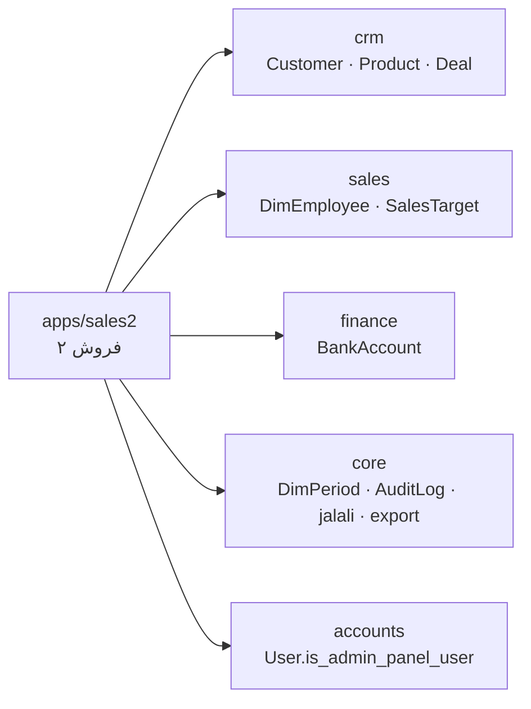
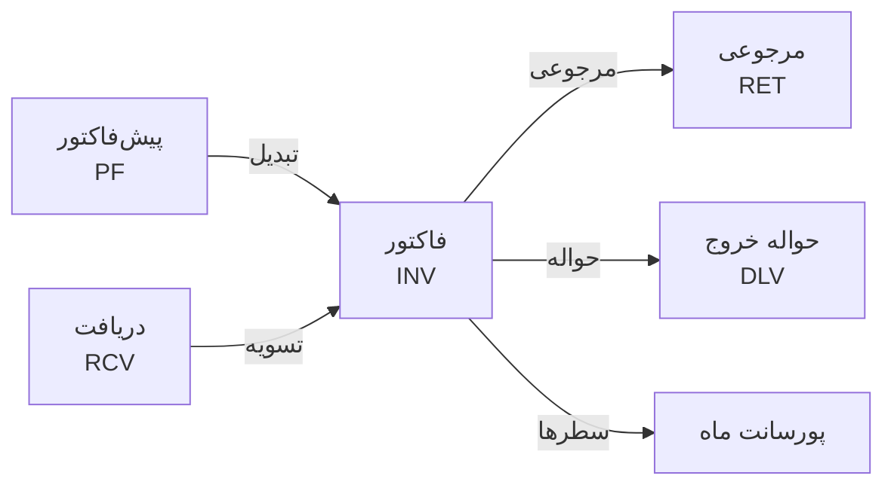

# هندآف فروش ۲

۱ مهر ۱۴۰۵

فروش ۲ یک ماژول فروش مستقل به سبک ERP است که پیش‌فاکتور، فاکتور، مرجوعی، حواله، دریافت و چک، مطالبات، لیست قیمت و پورسانت را خودِ سامانه صادر و حساب می‌کند؛ فعلاً فقط برای مدیر سامانه، روی شاخه‌ی v2-crm، commit نشده و روی سایت نرفته است.

## وضعیت فعلی

همه‌ی بخش‌های فاز اول ساخته و آزموده شده‌اند؛ آنچه مانده commit، ساخت فرانت برای سایت و اجرای import روی سرور است.

| بخش | وضعیت | یادداشت |
| --- | --- | --- |
| پیش‌فاکتور، فاکتور، مرجوعی | ساخته شد | صدور، ابطال، تبدیل، کپی، چاپ رسمی |
| کنترل زیان و سقف اعتبار | ساخته شد | عبور فقط با نوشتن دلیل |
| حواله‌ی خروج | ساخته شد | تحویل جزئی، سقف = مقدار فاکتور |
| دریافت و چک | ساخته شد | نقد، واریز، کارتخوان، چک با شناسه صیاد |
| مطالبات | ساخته شد | قاعده‌ی ۴۸ ساعت صیاد |
| لیست قیمت فرمولی | ساخته شد | ۴ برگه از اکسل تیر ۱۴۰۵ وارد شد |
| فی حسابداری | ساخته شد | ۵۷ فی از اکسل پورسانت مرداد |
| پورسانت | ساخته شد | در فروش ۲ و در منوی مالی |
| پاداش‌ها (مشتری جدید، شهر جدید، …) | ساخته نشد | ستون‌ها در اکسل خالی بودند |
| انبار و موجودی کالا | ساخته نشد | حواله موجودی را کم نمی‌کند |
| ارسال به سامانه مودیان | ساخته نشد | فقط شناسه‌ها روی فاکتور ثبت می‌شود |

- **کد:** شاخه‌ی `v2-crm`، هنوز commit نشده.
- **دیتابیس محلی:** مهاجرت‌های `sales2` 0001 تا 0004 اجرا شده؛ لیست قیمت، فی حسابداری و ۲۹ کالای تازه وارد شده؛ سند آزمایشی‌ای نمانده.
- **سایت:** هنوز نه `backend/spa` ساخته شده و نه مهاجرت و import روی سرور اجرا شده (به خواست کاربر).

## معماری و اتصالات

فروش ۲ یک اپ جنگوی جدا (`apps/sales2`) است که فهرست مشتری و کالای خودش را ندارد و از CRM می‌خواند؛ هر چه CRM نداشت (سقف اعتبار، قیمت، فی حسابداری) یک‌به‌یک کنار همان ردیف در sales2 نگه داشته می‌شود تا تجمیع بعدی فقط جابه‌جایی ستون باشد.



همه‌ی پیوندها یک‌طرفه‌اند: هیچ اپ دیگری به sales2 وابسته نیست.

| اپ | چه چیزی از آن استفاده می‌شود | نوع اتصال |
| --- | --- | --- |
| `crm` | `Customer`، `Product`، `Deal` (اختیاری) | ForeignKey؛ مشتری و کالا PROTECT |
| `sales` | `DimEmployee` (فروشنده)، `SalesChannel`، `SalesTarget` (تارگت در پورسانت) | ForeignKey و خواندن |
| `finance` | `BankAccount` (حساب یا صندوق دریافت) | ForeignKey اختیاری |
| `core` | `DimPeriod`، `AuditLog`، `jalali`، `export` | ForeignKey و تابع |
| `accounts` | `User.is_admin_panel_user` | شرط دسترسی |

عمداً وصل نیستند: `crm.SalesInvoice` (آرپا) و `sales.FactSalesMonthly`؛ `commercial` (شمارنده‌ی جدا `DocumentSequence`)؛ `CashMovement` مالی.

## مدل داده

۱۷ جدول در `apps/sales2/models.py`؛ سند صادرشده تغییر نمی‌کند: مشخصات مشتری، قیمت و بهای هر ردیف و جمع‌ها هنگام صدور روی خود سند ذخیره می‌شوند.

| مدل | نقش | نکته |
| --- | --- | --- |
| `SalesDocument` | پیش‌فاکتور، فاکتور، مرجوعی (`kind`) | draft · issued · converted · cancelled؛ `source`؛ `issue_checks`، `override_reason` |
| `SalesDocumentLine` | ردیف سند | `grammage` (۴۸/۵۵)، `unit_cost_rial` = فی حسابداری لحظه‌ی صدور، `source_line` |
| `DocumentSequence` | شمارنده به تفکیک پیشوند و سال شمسی | PF · INV · RET · DLV · RCV |
| `Delivery` · `DeliveryLine` | حواله‌ی خروج | سقف = فاکتور − مرجوعی − تحویل‌شده |
| `Receipt` | دریافت | فیلدهای چک، `cheque_status`، `sayad_registered`؛ حذف ندارد |
| `ReceiptAllocation` | تسویه‌ی دریافت با فاکتور | یکتا برای هر جفت |
| `CustomerAccount` | سقف اعتبار، مهلت پرداخت، توقف فروش | تهی = بدون سقف، صفر = فقط نقدی |
| `ProductPrice` | قیمت ثابت، حداقل قیمت، بهای پشتیبان | برای کالاهای غیررول |
| `PriceSheet` · `PriceSheetRow` | لیست قیمت فرمولی | یک برگه‌ی فعال برای هر گرماژ و رسمی/غیررسمی |
| `AccountingCost` | فی حسابداری به تفکیک کالا و گرماژ | گرماژ ۰ = بدون گرماژ |
| `CommissionTier` | پله‌های پورسانت | seed در 0004 |
| `CommissionOverride` | درصد دستی با دلیل | یک‌به‌یک با ردیف |
| `CommissionRun` | وضعیت پورسانت هر ماه | `snapshot` پس از تأیید |
| `Sales2Setting` | سربرگ و سیاست‌ها (pk=1) | ارزش افزوده، اعتبار پیش‌فاکتور، سیاست سقف |
| `Warehouse` | انبار | فقط برچسب حواله |

مبالغ ریال و Decimal بدون اعشار؛ API مبالغ را رشته برمی‌گرداند.

## چرخه‌ی سند و کنترل‌های صدور

پیش‌نویس ویرایش می‌شود و شماره ندارد؛ صدور شماره‌ی بی‌فاصله (مثل `INV-1405-0001`) می‌دهد و سند را قفل می‌کند؛ اشتباه فقط با ابطال یا مرجوعی جبران می‌شود.



قواعد (در `apps/sales2/services.py`):

- از هر پیش‌فاکتور فقط یک فاکتور غیرابطالی؛ صدور فاکتور آن را converted و ابطال فاکتور دوباره issued می‌کند.
- مرجوعی از باقی‌مانده‌ی هر ردیف بیشتر نمی‌شود.
- فاکتور دارای حواله، تسویه یا مرجوعی صادرشده ابطال نمی‌شود.
- هنگام صدور، مشخصات مشتری کپی و دوره‌ی ماهانه ثبت می‌شود.
- سررسید از «مهلت پرداخت» مشتری و اعتبار پیش‌فاکتور از تنظیمات.

کنترل‌ها (`run_checks`): ایراد جلوی صدور را می‌گیرد، «نیاز به دلیل» با دلیل عبور می‌کند، هشدار فقط ثبت می‌شود.

| کد | سطح | شرط |
| --- | --- | --- |
| `empty` · `quantity` · `price` | ایراد | بی‌ردیف، مقدار یا فی صفر |
| `grammage` | ایراد | رول بدون گرماژ |
| `return_qty` · `return_line` · `return_source` | ایراد | مرجوعی نامعتبر |
| `loss` · `doc_loss` | نیاز به دلیل | فی خالص زیر فی حسابداری |
| `on_hold` | نیاز به دلیل | فروش متوقف |
| `credit` | دلیل یا هشدار | مانده + چک وصول‌نشده + فاکتور بیش از سقف (block · warn · off) |
| `no_cost` · `below_min` · `tax_ids` · `vat_cert` · `proforma_expired` | هشدار | بها نامعلوم، زیر حداقل، شناسه‌ی ناقص، گواهی منقضی، پیش‌فاکتور منقضی |

محاسبه‌ی ردیف: خالص = مقدار × فی − تخفیف درصدی؛ ارزش افزوده فقط در فاکتور رسمی؛ گرد به ریال.

## دریافت، چک، صیاد و مطالبات

دریافتی که پول نیاورده پرداخت نیست؛ این قاعده فقط در `services.paid_receipts` است و بقیه از آن می‌خوانند. پرداخت حساب نمی‌شود اگر: ابطال شده، چک برگشتی/عودتی، یا چکی که ۴۸ ساعت پس از ثبت هنوز در **صیاد** ثبت نشده (`SAYAD_GRACE`). محاسبه از `created_at` و ساعت سرور است؛ cron ندارد. ثبت دیرهنگام در صیاد چک را برمی‌گرداند و تسویه‌اش از نو پخش می‌شود (`set_sayad`).

مانده‌ی مشتری (`customer_balance`): مانده = فاکتورها − مرجوعی − دریافت معتبر؛ ریسک کل = مانده + چک وصول‌نشده؛ اعتبار باقی = سقف − ریسک.

صفحه‌ی مطالبات (`services.receivables`):

| ستون | تعریف |
| --- | --- |
| باید بدهد | فاکتورها − مرجوعی‌ها |
| نقدی | نقد + واریز + کارتخوان |
| چک ثبت‌شده | ثبت در صیاد، بجز برگشتی/عودتی |
| چک ثبت‌نشده | هنوز داخل ۴۸ ساعت |
| پرداخت‌نشده | باقی؛ چک منقضی این‌جا می‌آید |

تسویه خودکار (قدیمی‌ترین سررسید)، دستی، یا علی‌الحساب.

## لیست قیمت فرمولی و فی حسابداری

همان فرمول اکسل هفتگی؛ با فاکتور واقعی تطبیق داده شد (۷۹×۳۶ رسمی ۵۵ گرم، پله‌ی ۵۰ رول = ۶۸۲٬۰۹۵ ریال).

قیمت = (عرض × متراژ × فی ۰۲ × ضریب ضایعات ÷ ۱۰۰۰ + اجرت برش + اجرت چاپ) × (۱ + درصد پله)

ضریب پیش‌فرض ۱۰۳٪ (چند سایز ۱۰۱٪)؛ اجرت چاپ فقط برای رول «چاپی».

| برگه | فی ۰۲ (ریال) | سایزها | از تاریخ |
| --- | --- | --- | --- |
| رسمی ۵۵ | ۲۰۹٬۰۰۰ | ۳۶ | ۱۴۰۵/۰۴/۰۱ |
| غیر رسمی ۵۵ | ۲۲۰٬۰۰۰ | ۳۶ | ۱۴۰۵/۰۴/۰۱ |
| رسمی ۴۸ | ۱۸۶٬۰۰۰ | ۳۶ | ۱۴۰۵/۰۴/۰۱ |
| غیر رسمی ۴۸ | ۲۰۰٬۰۰۰ | ۳۶ | ۱۴۰۵/۰۴/۰۱ |

پله‌ها: ۲۰۰ رول به بالا پایه، ۵۰ تا ۱۹۹ +۳٪، کمتر +۶٪ (`qty_tiers`).

قیمت‌گذاری ردیف (`pricing.quote`): رول بودن از نام کالا خوانده می‌شود؛ برگه با گرماژ و رسمی/غیررسمی؛ کالای غیررول قیمت ثابت؛ آخرین قیمت همین مشتری پیشنهاد می‌شود؛ فی تایپ‌شده با تغییر تعداد عوض نمی‌شود.

فی حسابداری (`AccountingCost`): مبنای کنترل زیان و پورسانت؛ هنگام صدور روی ردیف ثابت می‌شود. ۵۷ فی وارد شده؛ بقیه باید در صفحه‌ی «فی حسابداری» پر شوند.

## پورسانت

درصد هر ردیف با سود آن نسبت به فی حسابداری تعیین می‌شود؛ جدول ۱۸۹ از ۱۹۹ ردیف اکسل مرداد ۱۴۰۵ را دقیق بازسازی می‌کند.

| سود | درصد |
| --- | --- |
| زیر ۳٪ | ۰ |
| ۳ تا ۵٪ | ۰٫۵٪ |
| ۵ تا ۷٪ | ۰٫۷۵٪ |
| ۷ تا ۹٪ | ۱٪ |
| ۹ تا ۱۲٪ | ۱٫۲۵٪ |
| ۱۲ تا ۱۶٪ | ۱٫۵٪ |
| ۱۶٪ و بیشتر | ۲٪ |

سود = (فی خالص ÷ فی حسابداری − ۱) × ۱۰۰، گرد به یک رقم اعشار. جدول قابل ویرایش است؛ ردیف بدون فی پورسانت صفر.

| ستون | فرمول |
| --- | --- |
| پورسانت (پرداختی) | درصد × مبلغ کل ردیف × سهم پرداخت‌شده |
| پورسانت بازاریاب | درصد × مبلغ خالص ردیف |
| در انتظار تسویه | درصد × مبلغ کل × سهم پرداخت‌نشده |

- بازه: اسناد صادرشده در همان ماه شمسی؛ مرجوعی منفی با درصد ردیف مبدأ.
- درصد دستی فقط با دلیل (۰ تا ۲۰٪).
- تأیید ماه ارقام را در `snapshot` منجمد می‌کند؛ «باز کردن» آن را دور می‌ریزد.
- خلاصه‌ی «کل»: فروش، فاکتور، مشتری فعال/جدید، سود، تارگت.
- خروجی اکسل: برگه برای هر فروشنده + «کل».
- صفحه: `/sales2/commission` و `/finance/commission`.

## API

زیر `/api/sales2/`، پشت `Sales2Access`؛ کد در `views.py`، `views_pricing.py`، `urls.py`؛ تغییرات در `AuditLog`.

| مسیر | کار |
| --- | --- |
| `documents/` + `{id}/check|issue|cancel|convert|make-return|duplicate|print/` | اسناد و چرخه‌ی آن‌ها |
| `deliveries/` + `{id}/issue|cancel/` | حواله |
| `receipts/` + `{id}/allocate|cheque-status|sayad|cancel/` | دریافت و چک |
| `customers/` + `{id}/account|statement/` | مشتری، اعتبار، صورتحساب |
| `products/` + `{id}/price/` | کالا و قیمت ثابت |
| `quote/` | قیمت فرمولی + فی حسابداری + آخرین فروش |
| `price-sheets/` · `accounting-costs/` | لیست قیمت · فی حسابداری |
| `commission/` + `approve|override|tiers|export/` | پورسانت |
| `receivables/` · `summary/` · `sales-list/` (+`export/`) | مطالبات · داشبورد · لیست فروش |
| `settings/` · `options/` · `warehouses/` | تنظیمات |
| `line-price/` | قدیمی، بی‌استفاده |

## فرانت

فضای کاری جدا مثل CRM: `components/sales2/Sales2Shell.vue`، ورود از دکمه‌ی «فروش ۲» در `AppShell`.

| مسیر | صفحه (`views/sales2/`) |
| --- | --- |
| `/sales2` | `Sales2DashboardView` |
| `/sales2/proformas|invoices|returns` | `DocumentsView` |
| `/sales2/documents/new/:kind` · `documents/:id` | `DocumentEditorView` |
| `/sales2/print/:id` | `DocumentPrintView` |
| `/sales2/deliveries` · `receipts` · `receivables` | حواله · دریافت · مطالبات |
| `/sales2/customers` · `customers/:id` | مشتریان |
| `/sales2/price-list` · `accounting-costs` · `products` | لیست قیمت · فی حسابداری · کالاها |
| `/sales2/sales-list` · `commission` · `settings` | لیست فروش · پورسانت · تنظیمات |
| `/finance/commission` | `CommissionView` داخل AppShell |

فایل‌ها: `api/sales2.ts`؛ `components/sales2/` (`CustomerSearch`، `ReceiptForm`، `DeliveryForm`)؛ `utils/numberWords.ts`؛ تغییر در `router/index.ts`، `AppShell.vue`، `UiHost.vue`.

## دسترسی و امنیت

فقط `User.is_admin_panel_user` (سوپریوزر، نقش admin، یا تیک `admin_access`).

- API: `apps/sales2/permissions.py` ← `Sales2Access`؛ مسیرها: `meta.adminPanel`؛ منو: `auth.isAdminPanelUser`.
- برای باز کردن به مالی یا فروش، `can_use_sales2` و شرط‌های منو و route عوض شوند.
- فقط پیش‌نویس پاک می‌شود؛ دریافت حذف ندارد؛ همه‌ی تغییرات در `AuditLog`.
- شماره با `select_for_update`.

## مهاجرت‌ها، داده‌ی اولیه و استقرار

| مهاجرت | محتوا |
| --- | --- |
| `0001_initial` | اسناد، حواله، دریافت، حساب مشتری، قیمت، انبار، تنظیمات، شمارنده |
| `0002_cheque_sayad_registration` | فیلدهای صیاد |
| `0003_price_list_costs_commission` | لیست قیمت، فی حسابداری، پورسانت، `grammage` |
| `0004_seed_commission_tiers` | ۶ پله‌ی پورسانت از ۳٪ به بالا |

گام‌ها:

1. `build-spa.bat` (deploy.sh فرانت را نمی‌سازد).
2. commit و push شاخه‌ی `v2-crm` و merge به `main`.
3. `deploy.sh` روی سرور (migrate و برگشت خودکار).
4. یک بار روی سرور:

```bash
python manage.py import_sales2_workbooks --prices "لیست قیمت1405هفته اول تیر.xlsx" --costs "پورسانت مردادماه.xlsx" --create-missing
```

`--prices` برگه‌ی فعال هر نوع را جایگزین می‌کند؛ `--costs` فی حسابداری را می‌خواند؛ `--create-missing` کالاهای نبوده در CRM را با کد `s2-N` می‌سازد. سپس سربرگ شرکت و یک انبار در تنظیمات.

## تست‌ها

۲۰ تست در `apps/sales2/tests.py` پاس؛ کل بک‌اند (۶۳۸) سبز؛ `vue-tsc` بدون خطا.

| گروه | پوشش |
| --- | --- |
| `AccessTests` | ۴۰۳ برای غیرادمین |
| `DocumentTests` | جمع، شماره، قفل، زیان، سقف، تبدیل |
| `ChainTests` | مرجوعی، حواله، تسویه، چک برگشتی، لیست فروش |
| `ReceivablesTests` | ستون‌های مطالبات، انقضای ۴۸ ساعت |
| `PricingAndCommissionTests` | فرمول قیمت، گرماژ، پورسانت، تأیید ماه |

```bash
cd backend && .venv/Scripts/python.exe manage.py test apps.sales2
```

## تصمیم‌های باز، ریسک‌ها و کارهای بعدی

مهم‌ترین کار: کامل کردن فی حسابداری.

تصمیم‌هایی که باید تأیید شوند:

- چک ثبت‌شده در صیاد پس از ۴۸ ساعت دوباره پرداخت حساب می‌شود.
- اجرت چاپ فقط برای کالای «چاپی».
- سود پورسانت روی فی خالص بدون ارزش افزوده.
- «مشتری جدید» فقط بر اساس فروش ۲.

ریسک‌ها:

- ثبت هم‌زمان در آرپا و فروش ۲ دو عدد متفاوت می‌دهد.
- کالاهای `s2-N` به کد آرپا وصل نیستند.
- موجودی انبار کنترل نمی‌شود.

کارهای بعدی:

- [ ] پر کردن فی حسابداری همه‌ی کالاها
- [ ] سربرگ شرکت و انبار
- [ ] commit، ساخت spa، استقرار و import
- [ ] قاعده‌ی پاداش‌ها از مالی
- [ ] باز کردن دسترسی به مالی و فروشنده‌ها
- [ ] ثبت دریافت‌ها در نقدینگی مالی (`CashMovement`)
- [ ] اتصال به داشبوردهای فروش و تجمیع
- [ ] موجودی انبار و سامانه مودیان
- [ ] حذف `line-price/`
